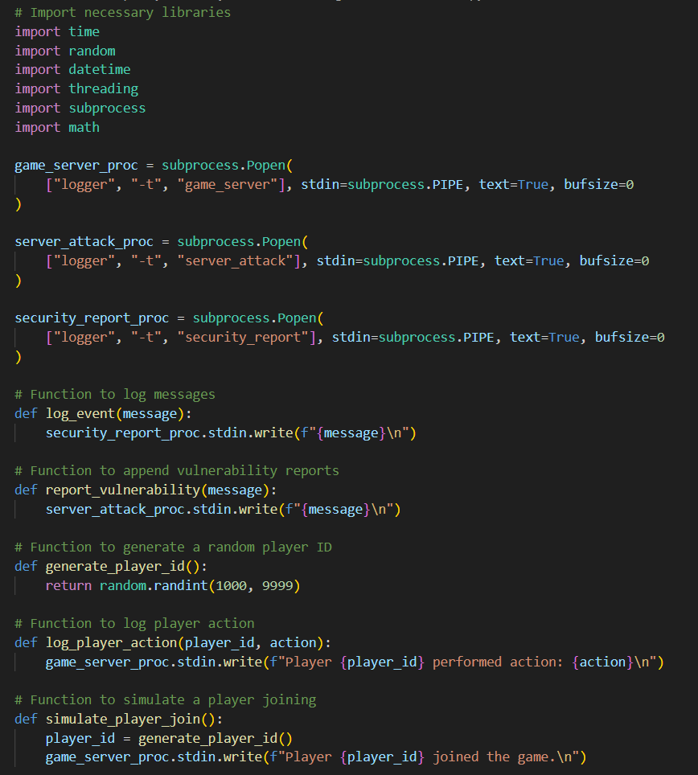
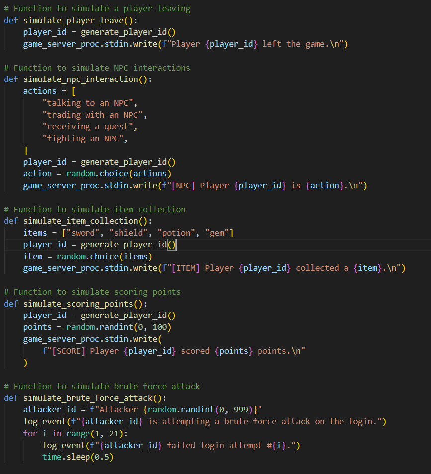
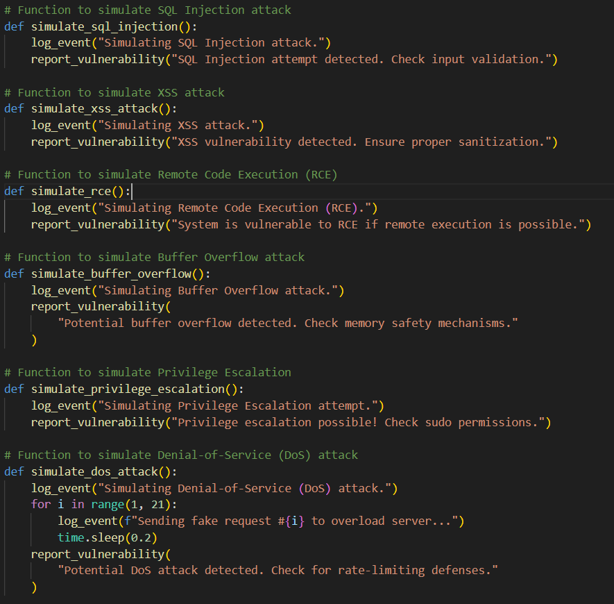
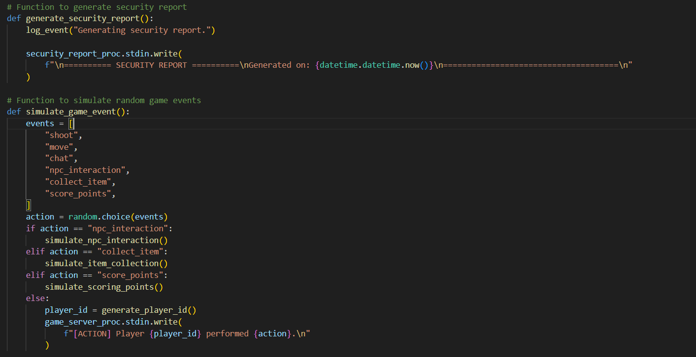
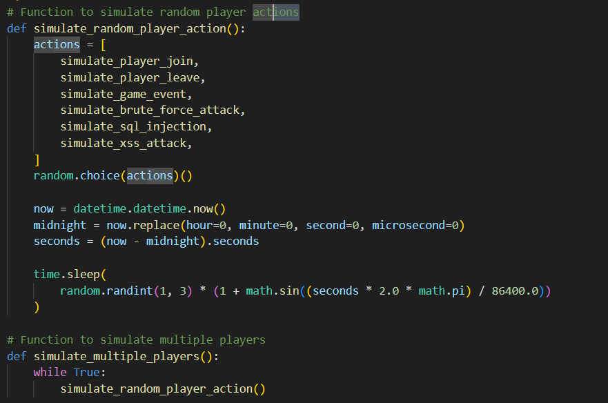
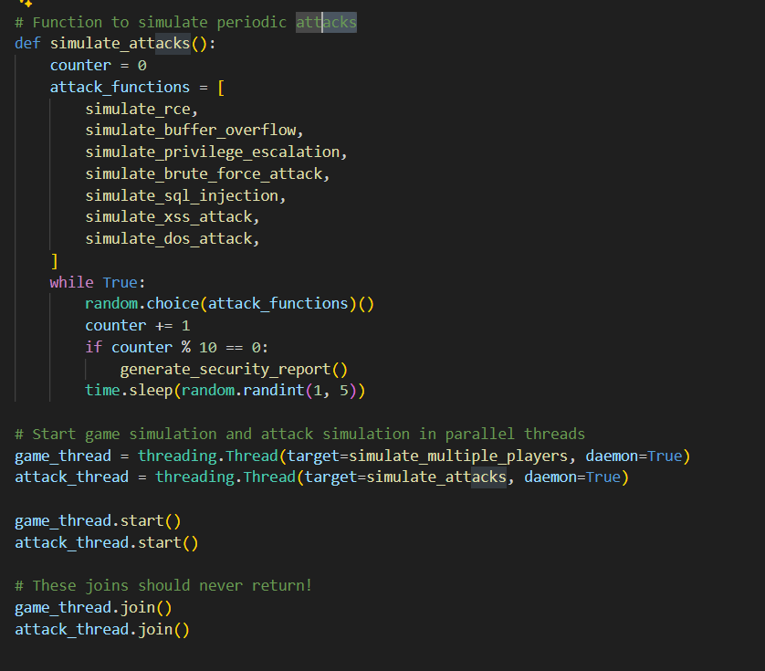
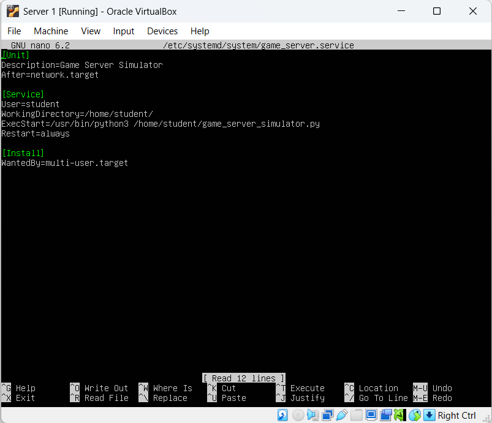
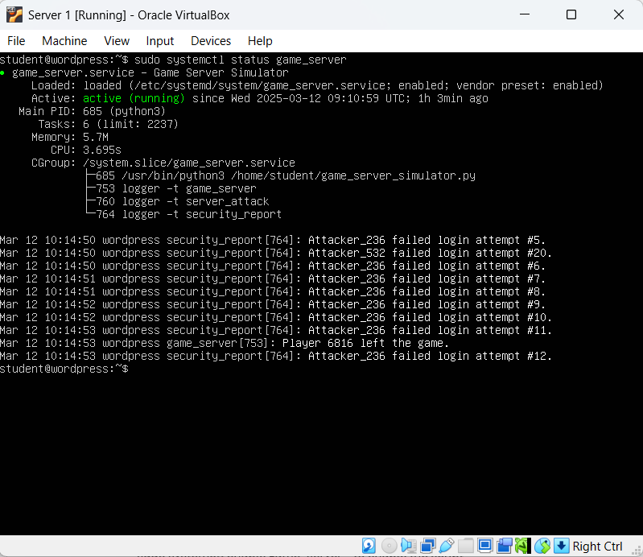
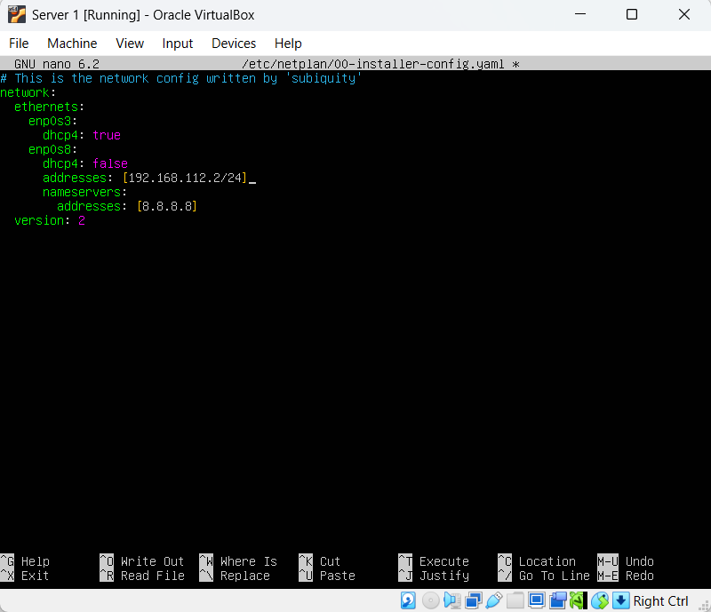

# Security Automation – Setting up servers for scanning

As part of the project that have been assigned to us we were required to have a Game Servers that shows different  logs and attacks against them,
so when scanned with Wazuh and Green Bone.

The steps that have been taken to create the servers are as follow:
* Creating a Python code that generates logs of attacks against the server and player activities.
* Copying the code on all server machines and executing it to run after the servers are powered on.
* Assigning the IP addresses for each server

Creating the Python code – the code that have been created have two main parts:
1.	To generate Players activities on the servers and store hem in the log file 
2.	To generate the Attacks against the servers and also store them in the log file

Player activities – the following are list of the activities that the code generates in the log files of the server once they are powered on:
* Log messages
* Random player ID’s
* Player action
* Player joining and leaving
* Interaction with the NPC’s such as talking, trading, receiving quests and fighting NPC
* Collecting items
* Scoring points
* Simulate game events which are based on NPS interaction and players

Attacks – the attacks that will be simulated in the servers are as follow and the outcome from them will be used in the scans which will
be performed on Wazuh and Green Bone:
* Brute force
* SQL injection
* XSS (Cross-scripting) 
* Remote code execution
* Buffer overflow
* Privilege escalation
* Denial of Service (DoS)

The following pictures represent how the whole code was build and outline each of the functionalities that have been implemented. 







Once the code was build and saved as .py file, then it was transferred to the servers.
To transfer the file on the server the following commands have been used for secure transfer from Ubuntu Desktop machine as the .py code was build
in a desktop environment:
*  `sftp student@192.168.123.30` - that was the IP of the server at the time. 
* `put game_server_simulator.py`
* `exit`

When the transfer was completed using “ssh” I connect to the server to complete the next steps and enable the code to start working when the server is powered on.
To connect to it the following command was used
* `ssh student@192.168.123.30`

When I was connected to the server the next thing that have been done was to check if the python is installed as it was required for the .py code to run.
* python3 -version`

The above command displays if the python3 which was installed. In my case python3 was not installed so it had to be install it on the server.
To install it the following commands have been used to obtain it on the server:
* `sudo apt update`
* `sudo apt install python3`
* `sudo apt install python3-pip`

Once the python3 was successfully installed the next what have been done was to change the permissions of the .py file, so it can be executable.
To do that I have used the following:
* `chmod +x game_server_simulator.py`

When the permissions of the file have been changed so it can be executed on the server the following steps have to been taken
in order to make it run automatically when the server starts. The first step was to open the system configuration file.
To do that the following command have been used:
* `sudo nano /etc/systemd/system/game_server.service`

The following picture represents the configuration that have been made in order the script to start running
and creating log entries once the server is up and running. 


Once that have been included in the configuration file the next step was to enable and start the service. To do that the following commands have been used:
* `sudo systemctl daemon-reload – to reload the configuration`
* `sudo systemctl enable game_server – to enable the script`
* `sudo systemctl start game_server – to start it`
* `sudo systemctl status game_server – to check if the script is running properly`


The next thing that have been done was to create two more servers like that.
As we are using virtual environment I was able to clone it so we have ended up with three server.
In a real case scenario the same steps will have to be performed for each individual server.

Once I had all three of them the next thing was to assign them the proper IP addresses as if they all had the same IP simply they won’t work
as it will create interference. First what I did was to add second network card in each of them.
The first card was left on NAT so the servers can get network access and the second one was set to Bridged adapter so it can communicate with the Wazuh
and Green Bone scanners. 

To change the IP addresses on the servers the following steps have been taken:
1.	Locate the netplan of the server – to do that the following command have been used:
 * `ls /etc/netplan/`
2.	To change the netplan and set static IP on each server:
 * `sudo nano /etc/netplan/"name of the netplan that have been given"
3.	The following picture will show my configuration of the netplan and the setup of the IP address
 * 

4.	Once the netplan have been edited according to my needs I have save it and to implement the changes fully the following command have been used:
 * `sudo netplan apply`

By doing this steps on each server individually I have successfully changed the IP addresses and they were ready for the Wazuh agent to be installed on them.
Wazuh agent is need on each individual machine so the Manager can retrieve data from them. To be able to install the agent the following command 
was executed on each server:

```$ wget https://packages.wazuh.com/4.x/apt/pool/main/w/wazuh-agent/wazuh-agent_4.10.1-1_amd64.deb && sudo WAZUH_MANAGER='192.168.112.2'
WAZUH_AGENT_NAME='name on the server that will be monitored' dpkg -i ./wazuh-agent_4.10.1-1_amd64.deb
```

By doing so, and adding the name of the server that have to be monitored after the equal sign which is right after WAZUH_AGENT_NAME the manager
was able to detect that server and is able to perform scans on it. This step was repeat it on each server and all three of them become visible on the
dashboard of Wazuh.
