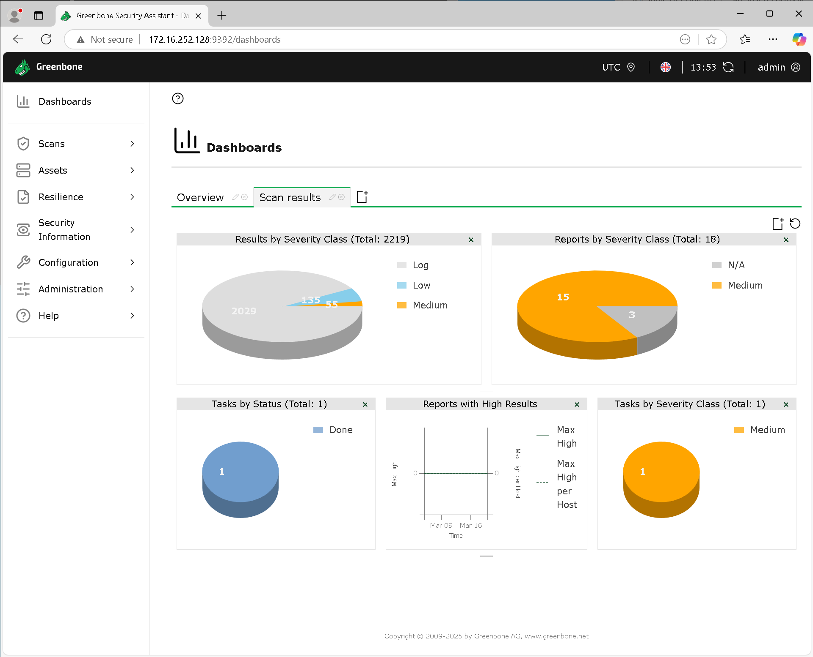
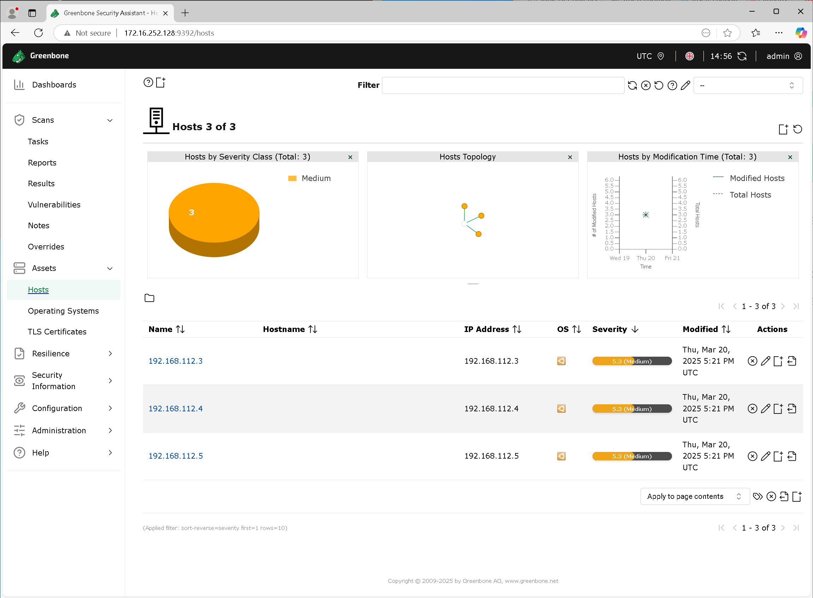
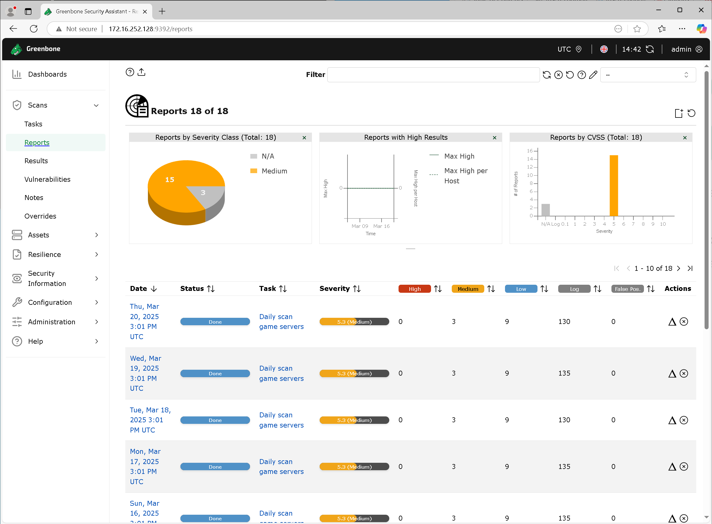
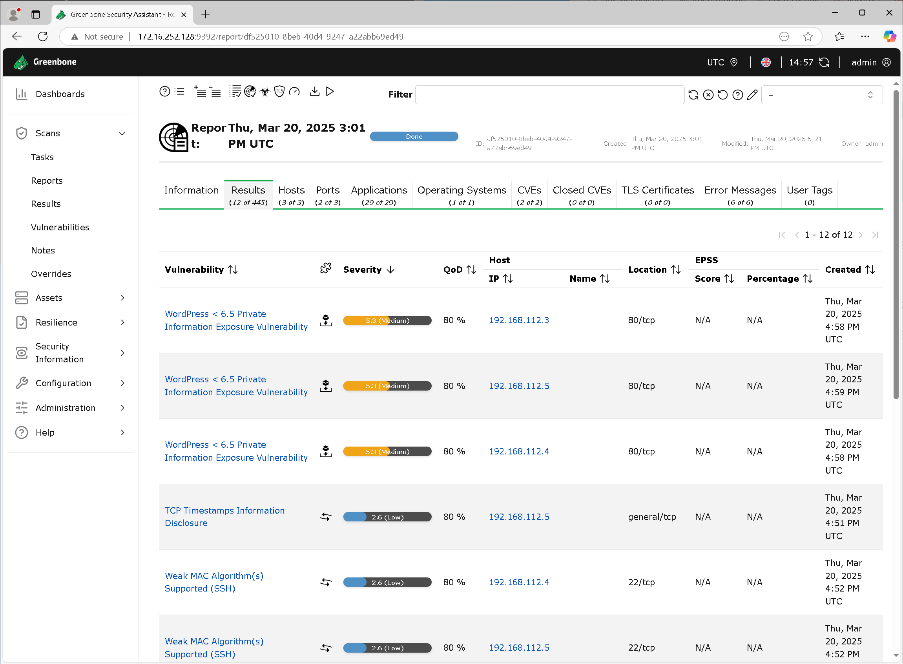
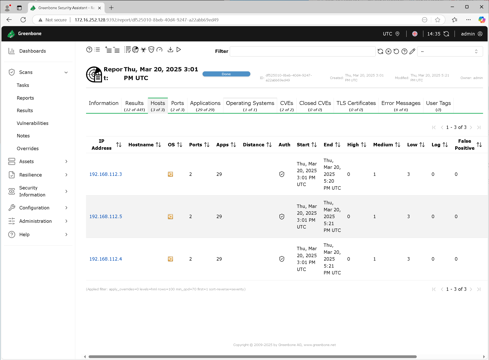
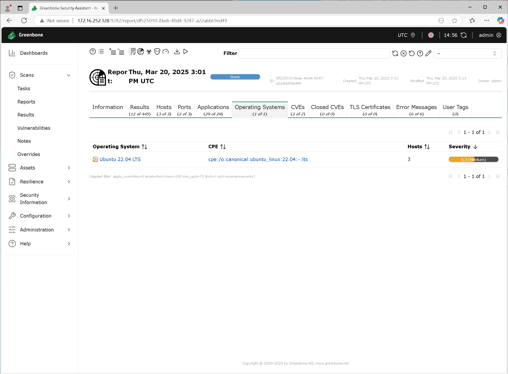
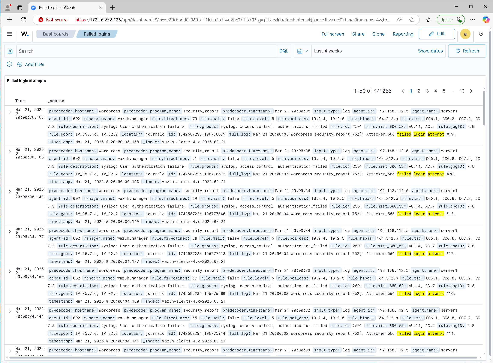
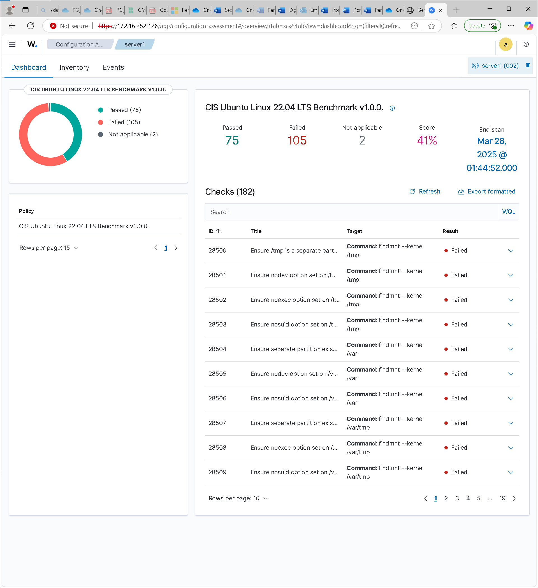
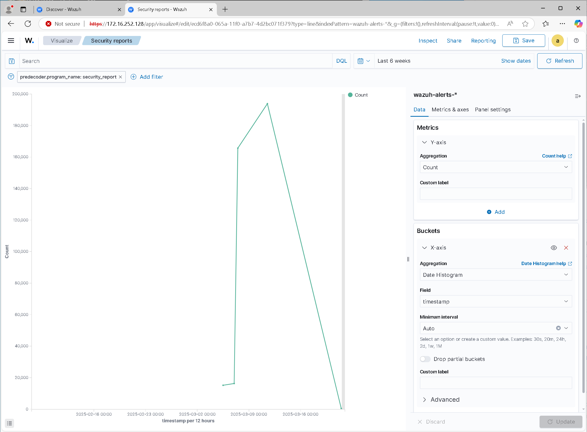
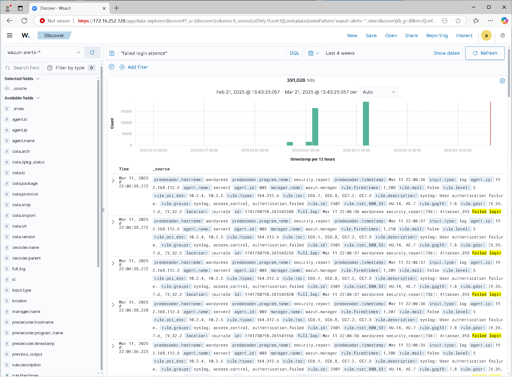

# Screenshots

## Greenbone

*Dashboard summarising recent scans.*

*OSs found by scans.*

*A list of scan reports.*

*Results of a scan.*

*Scanned hosts.*

*Scanned OSs.*

## Wazuh

*Dashboard configured in Wazuh.*

*CIS benchmark report produced by Wazuh.*

*Graph of failed login attempts over item.*

*Search finding failed login attempts.*

